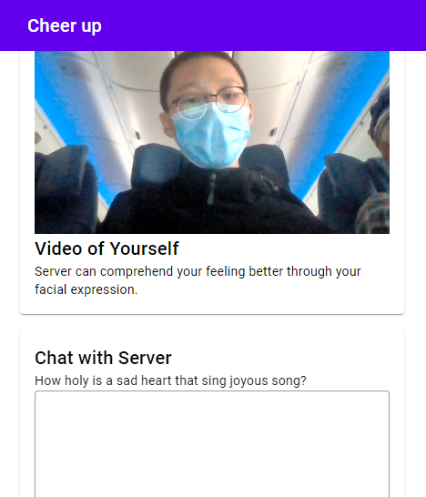
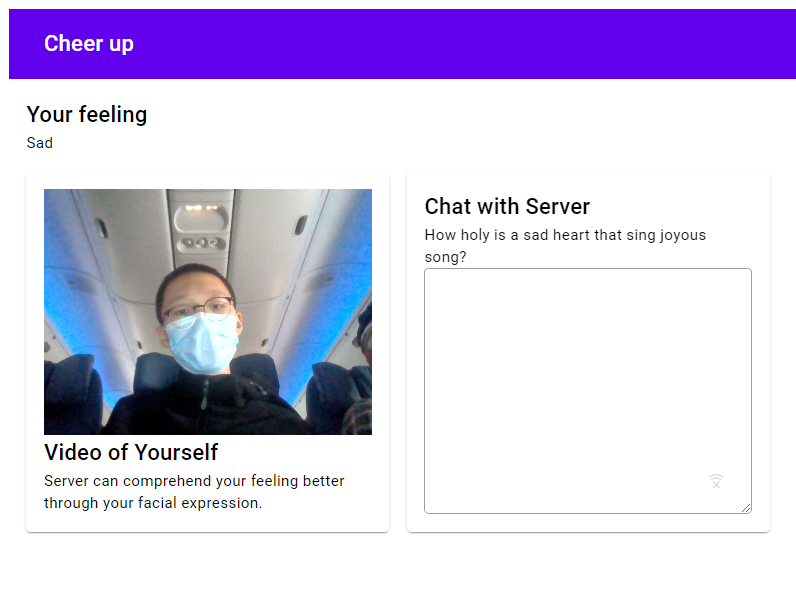

# Cheer Up

## Introduction

This project aims to detect the mood of a person through CNN image classification by taking a video of the user. Further, it attempts to employ NLP technique to generate response that potentially alleviate and address the feeling of user, optionally allowing the user to type in the text area.

## Framework

This project uses the following framework
- Material design components, such as card, text area, app bar, etc. The responsive web design is achieved through the usage of dynamic layout grid.
- Flask is used to compute the model locally.
- ONNX runtime. The model is trained with Google colab and running at ONNX runtime provided by tensorflow lite.

## Demo

## Todo

This project is currently under heavy development. The website is build, but the backend and algorithms is still in progress.